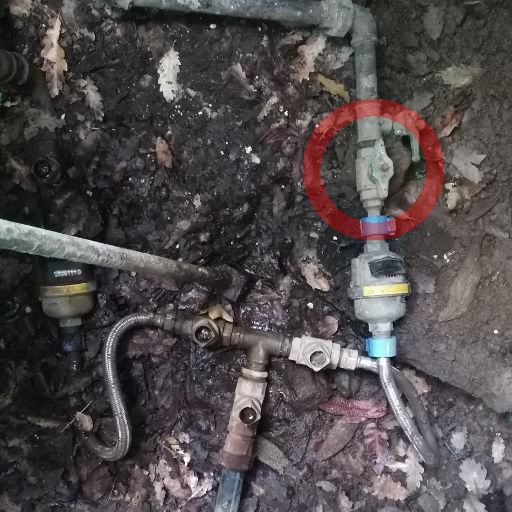
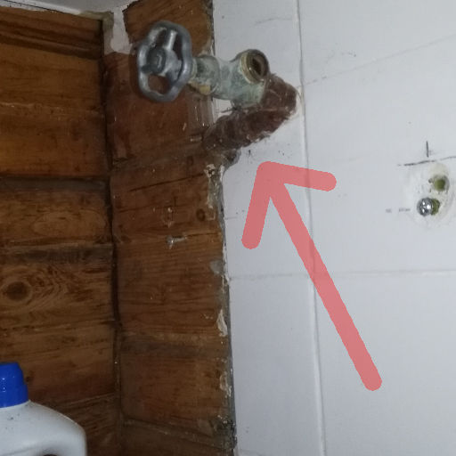
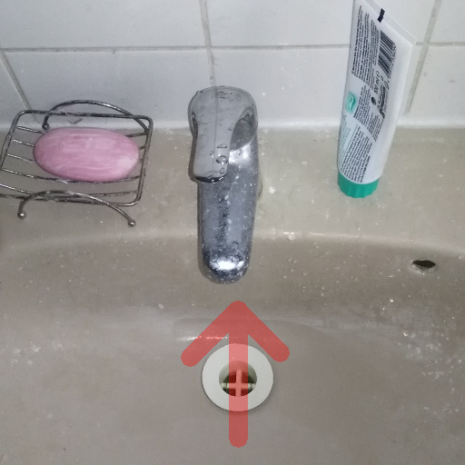
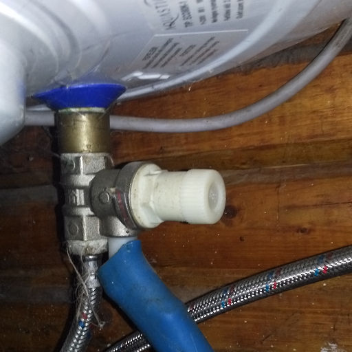
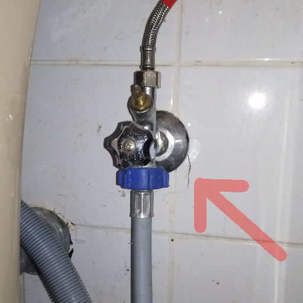
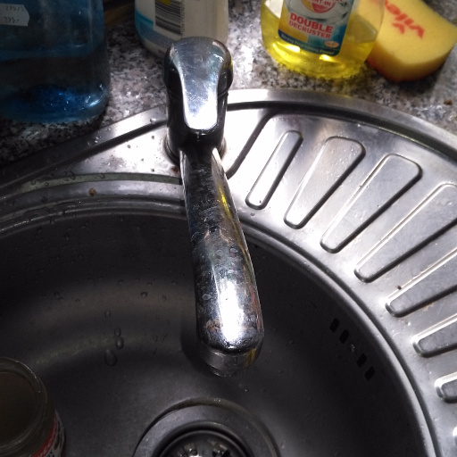
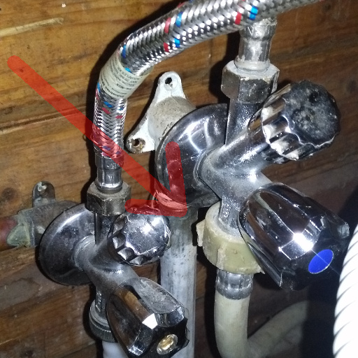
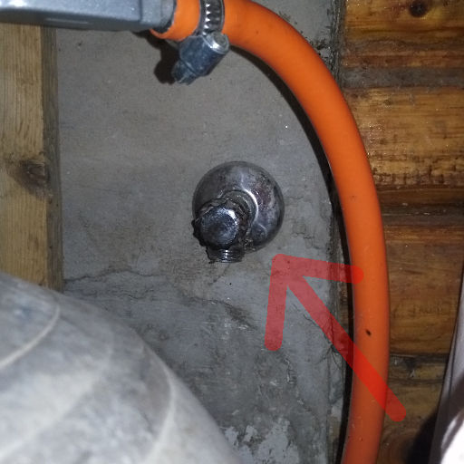
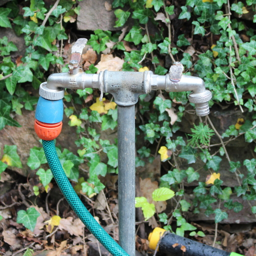
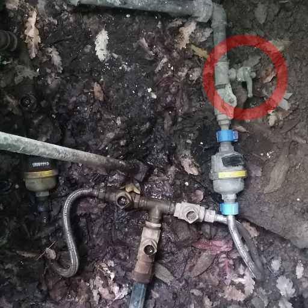

# Víztelenítés Szepezden

Mielőtt jön  a tél vízteleníteni kell a csöveket és a bojlert, hogy  ne fagyjon bele a víz. Miután lezártuk a vízaknában a fővezetéket, a házban és a kertben minden csapot nyitva kell hagyni télre.

## Az aknában:

A vízaknában a csapot le kell zárni. Az utcáról nézve jobb oldali vízóra a miénk. Azt a csapot kell lezárni, ami a vízórához közelebb van:

## A fürdőszobában:

1. A régi WC öblitő csövet kinyitni:  

2. Az új WC-t lehúzni

3. A mosdóban a csapot középső állásban kinyitni és úgy hagyni:  

4. A zuhanycsapot is középső állásban kell nyitva hagyni.

5. A bojlerből kiengedni az összes vizet - de előtte az áramot le kell kapcsolni ott a falon:  

6. A mosógép slaugot (kék műanyag csavar, elvileg kézzel lehet kinyítni) leszerelni - a víz folyhat a padlón az összefolyóba:  

7. A mosógépet kinyitni, hogy belülről ne büdösödjön be

## A konyhában:

1. A mosogatócsapot kinyitni és középső állásban hagyni:  

2. A mosógatógép slaugot lecsavarni - a mosogató alatt. A vizet egy lábosba lehet engedni és kiönteni. A mosogatógép csapot esetleg lezárni, hogy nyitáskor ne legyen minden vizes.  

3. A tűzhely meletti csapot (ahol a gázpalack áll) kinyitni és a vizet egy lábosba engedni:  

## A kertben:

1. A kerti csapot kinyitni, mindkét csapot, és a kerti slaugot is vízteleníteni  

2. A vízaknában a másik csapnál kiengedni a maradék vizet és nyitva hagyni:  

